# VIORA
### AI-Powered Dynamic Mental Health Monitoring & Distress Prediction System for Victims of Atrocities

[](https://sih.gov.in)
[-005082?style=flat-square)](https://socialjustice.gov.in)
[](#)
[%20%2B%20IVRS%20%2B%20Mobile-2ea44f?style=flat-square)](#)
[-7952b3?style=flat-square)](https://sarvam.ai)
[](#12-unified-single-command-system-orchestration)

> ### Smart India Hackathon (SIH 2026) Challenge
> **Problem Statement ID:** `SIH26094`  
> **Title:** AI-Powered Dynamic Mental Health Monitoring and Distress Prediction System for Victims of Atrocities  
> **Organization:** Ministry of Social Justice and Empowerment (MoSJE)  
>
> **The Problem:** In atrocity and violent crime recovery, existing institutional frameworks focus heavily on initial legal aid and monetary compensation, but completely lack continuous, long-term monitoring of psychological well-being. Victims frequently suffer prolonged trauma, intimidation by perpetrators, social ostracism, and severe mental distress during protracted legal battles. **Over 80% of victims are lost to follow-up within 60 days of initial crisis discharge**, leading to unmonitored relapse, repeated assaults, and preventable self-harm.
>
> **The VIORA Solution:** An integrated dual-surface platform purpose-built for the Ministry of Social Justice and Empowerment:
> 1. **For Victims & Complainants:** A trauma-informed, barrier-free native Indic voice companion (operating via smartphone or IVRS/telephony in Hindi, Hinglish, and regional dialects) that conducts gentle, unhurried check-ins strictly within safe contact windows.
> 2. **For District Social Welfare Officers (DSWO) & Counsellors:** A clinical decision support system with deterministic Stress Vulnerability Index (SVI) scoring, closed-form trajectory slope predictions, < 2-hour SLA emergency crisis alert routing, and district-wide geographic distress hotspot surveillance for proactive intervention.

---

## Table of Contents

1. [System UI/UX Showcase & Live Prototype Walkthrough](#1-system-uiux-showcase--live-prototype-walkthrough)
   - [Part A: Frontline Clinical Decision Support Portal (DSWO & Caseworkers)](#part-a-frontline-clinical-decision-support-portal-dswo--caseworkers)
   - [Part B: Trauma-Informed Mobile Companion (Victim Experience)](#part-b-trauma-informed-mobile-companion-victim-experience)
2. [The Core Architectural Thesis: The Determinism Boundary](#2-the-core-architectural-thesis-the-determinism-boundary)
3. [System Architecture & Flow Topology](#3-system-architecture--flow-topology)
4. [District Authority Geographic Hotspot Surveillance Engine](#4-district-authority-geographic-hotspot-surveillance-engine)
5. [Clinical Caseworker Decision Support Dashboard](#5-clinical-caseworker-decision-support-dashboard)
6. [Longitudinal Case Dossier & Full Bilingual Call Transcript](#6-longitudinal-case-dossier--full-bilingual-call-transcript)
7. [Real-Time Clinical Alerts & Rapid Triage Engine](#7-real-time-clinical-alerts--rapid-triage-engine)
8. [Predictive Follow-Up Cadence & Trajectory Engine](#8-predictive-follow-up-cadence--trajectory-engine)
9. [Live Indic Voice Engine & Acoustic DSP Pipeline](#9-live-indic-voice-engine--acoustic-dsp-pipeline)
10. [Mathematical Formulations Reference](#10-mathematical-formulations-reference)
11. [Monorepo Directory Layout](#11-monorepo-directory-layout)
12. [Unified Single-Command System Orchestration](#12-unified-single-command-system-orchestration)
13. [Verification, Test Suite & Health Probes](#13-verification-test-suite--health-probes)

---

## 1. System UI/UX Showcase & Live Prototype Walkthrough

VIORA is delivered as an integrated, multi-surface operational platform. The screenshots below are captured directly from the live, fully functional prototype running in the evaluation environment.

---

### Part A: Frontline Clinical Decision Support Portal (DSWO & Caseworkers)

Designed for District Social Welfare Officers, state crisis monitors, and frontline clinical psychologists managing active trauma caseloads.

---

#### 1. District Geographic Distress Hotspots (Spatial Surveillance Map)
Provides district magistrates and welfare directors with high-level geographical intelligence on where distress is concentrating across administrative blocks.

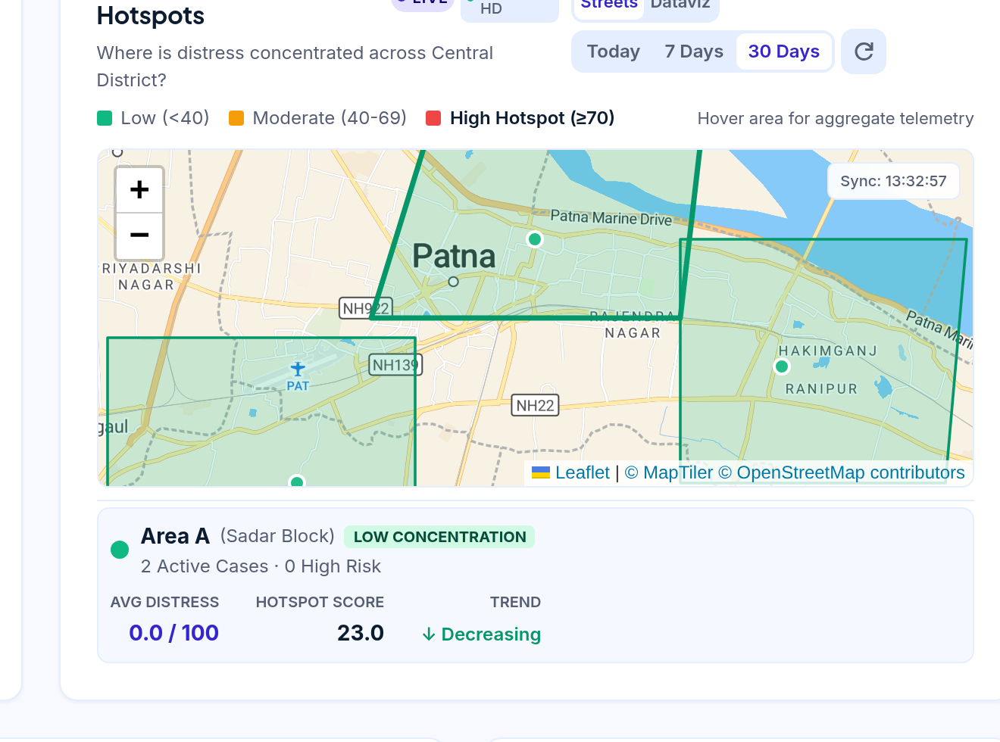

* **What is happening in this UI:**
  * **MapTiler Vector Basemap:** Renders administrative polygons across Central District (Patna), highlighting **Area A (Sadar Block)**, **Area B (Danapur Block)**, and **Area C (Bikram Block)**.
  * **Live Aggregation Telemetry:** The bottom card highlights **Area A (Sadar Block)** as **Low Concentration** with 2 Active Cases, 0 High Risk, 0.0/100 Average Distress, a Hotspot Score of **23.0**, and a **$\downarrow$ Decreasing** trend.
  * **Operational Value for MoSJE:** Identifies developing geographic distress spikes so the district administration can dispatch mobile counseling vans and welfare officers before crises escalate.
  * **Confidentiality by Design:** Enforces strict $k$-anonymity. Individual survivor GPS coordinates are never captured or rendered; data is strictly bounded to administrative blocks.

---

#### 2. Clinical Caseworker Dashboard (Triage Unit & Ward 3B)
The primary operational overview for on-duty caseworkers managing patient follow-ups and real-time alerts.

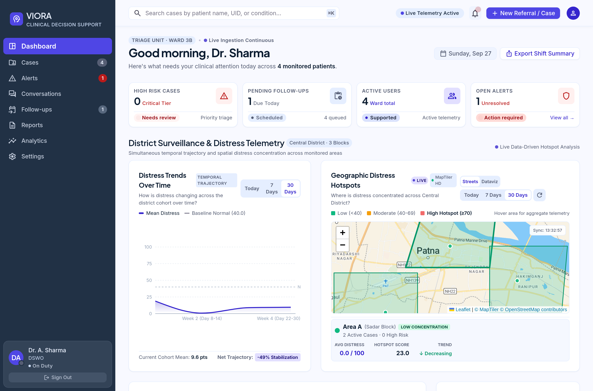

* **What is happening in this UI:**
  * **Triage Status Banners:** Logged in as **Dr. A. Sharma (DSWO, On Duty)** under `Triage Unit · Ward 3B`, showing continuous live ingestion.
  * **Caseload At-a-Glance Cards:** Displays 0 Critical Tier cases, 1 Pending follow-up due today, 4 Monitored ward patients, and 1 Unresolved action-required alert.
  * **30-Day Longitudinal Distress Curve:** Visualizes cohort stabilization over time against the baseline clinical threshold ($40.0$), displaying a **$-49\%$ net stabilization**.
  * **One-Click Shift Export:** The `Export Shift Summary` button instantly produces formal audit-ready clinical handover reports for supervisory welfare officers.

---

#### 3. Longitudinal Case Dossier & Full Bilingual Call Transcript
The complete forensic clinical record of a monitored survivor, showing multi-session trajectories and verbatim speech transcripts.

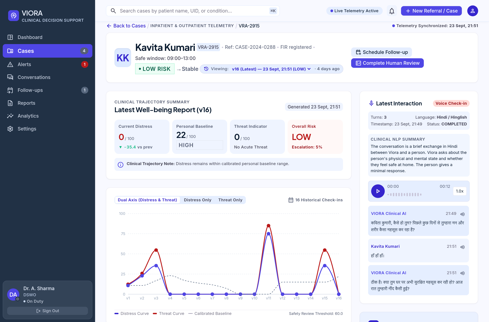

* **What is happening in this UI:**
  * **Survivor Profile Header:** Details for **Kavita Kumari** (`VRA-2915`, Ref: `CASE-2024-0288`, `FIR registered`, Safe window: `09:00 - 13:00`).
  * **Telemetry Summary (Report v16):** Current Distress: **$0/100$**, Calibrated Personal Baseline: **$22/100$** (High Confidence), Threat Indicator: **$0/100$**, Overall Escalation Probability: **$5\%$**.
  * **Dual-Axis Trajectory Graph:** 16 historical check-ins tracking psychological distress (blue curve) against physical threat (red curve), demonstrating complete longitudinal recovery.
  * **Embedded Audio Waveform Player:** Caseworkers can listen to the actual recorded survivor audio at $1.0\times$ speed.
  * **Verbatim Bilingual Conversation Transcript:** Turn-by-turn timestamps (`21:49`, `21:51`) showing conversational exchanges in natural Hindi with structured clinical NLP summaries.

---

#### 4. Real-Time Clinical Alerts Queue & Rapid Triage
Automated crisis detection engine that surfaces acute trauma disclosures directly to frontline supervisors with strict SLA response countdowns.

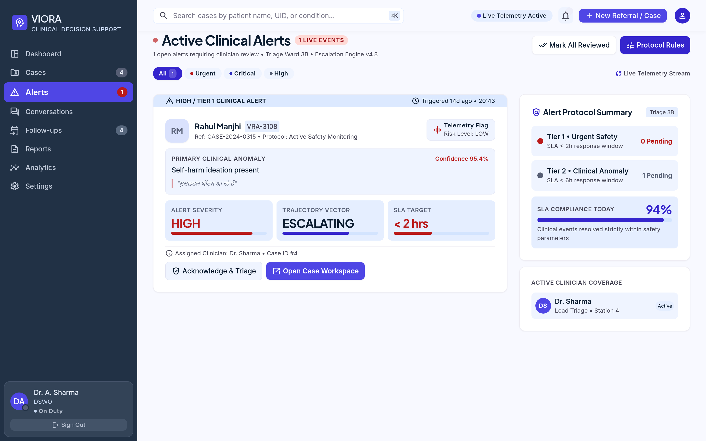

* **What is happening in this UI:**
  * **Active Tier 1 Alert:** Flagged for **Rahul Manjhi** (`VRA-3108`, Ref: `CASE-2024-0315`, Protocol: `Active Safety Monitoring`).
  * **Primary Clinical Anomaly:** `Self-harm ideation present` detected with **$95.4\%$ extraction confidence**.
  * **Verbatim Grounding Quote:** Extracts the exact Hindi utterance: *"सुसाइडल थॉट्स आ रहे हैं"*.
  * **SLA Target Countdown:** **$< 2\text{ hours}$ response SLA** with an **ESCALATING** trajectory vector.
  * **Action Workflow:** Clinician can immediately click `Acknowledge & Triage` or `Open Case Workspace` to initiate emergency human contact.

---

#### 5. Dynamic Follow-Up Cadence Scheduler
Predictive scheduling replacing rigid weekly calendars with evidence-based touchpoints derived from mathematical trajectory slopes.

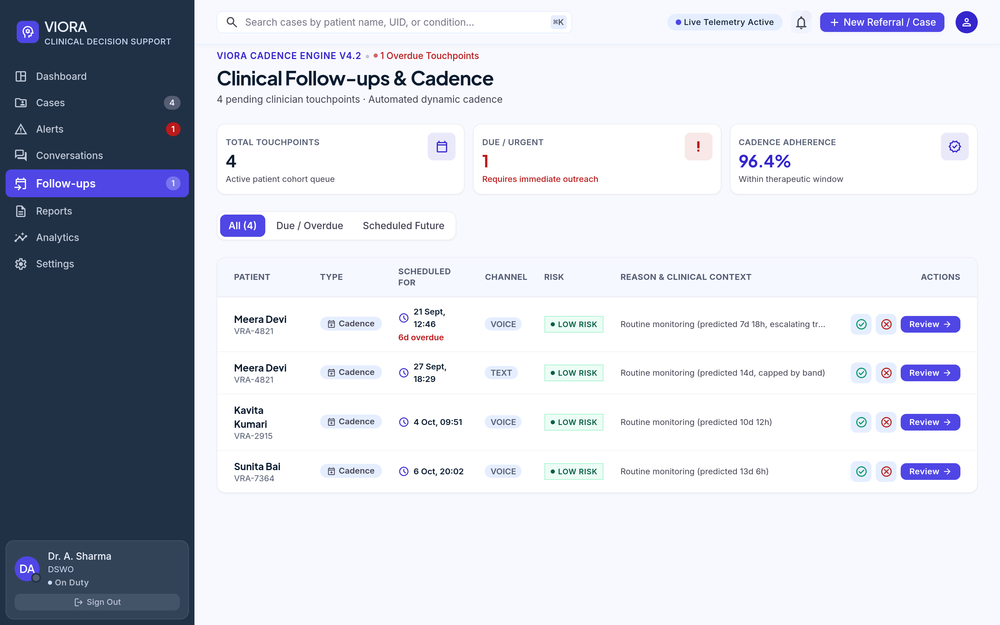

* **What is happening in this UI:**
  * **Cadence Engine v4.2 Status:** 4 active touchpoints with an overall **$96.4\%$ therapeutic window adherence rate**.
  * **Dynamic Predictive Intervals:**
    * **Meera Devi (`VRA-4821`):** Flagged as `6d overdue`, scheduled dynamically at $7\text{d } 18\text{h}$ due to an escalating trajectory.
    * **Kavita Kumari (`VRA-2915`):** Scheduled for 4 Oct ($10\text{d } 12\text{h}$ interval) based on a stabilized baseline.
    * **Sunita Bai (`VRA-7364`):** Scheduled for 6 Oct ($13\text{d } 6\text{h}$ interval) reflecting de-escalating recovery.
  * **Safe-Window Verification:** Every touchpoint aligns strictly with survivor-verified safe contact windows.

---

#### 6. Cohort Directory & Caseload Stratification
Master registry enabling clinical supervisors to audit and filter the entire monitored population.

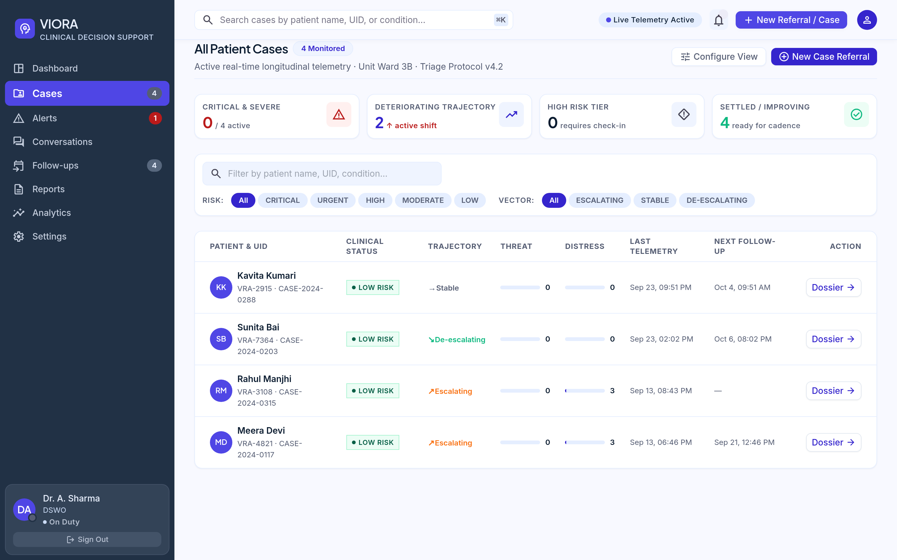

* **What is happening in this UI:**
  * **Cohort Overview Metrics:** 4 Active cases, 0 Critical, 2 Deteriorating trajectories requiring intervention, 4 Settled for cadence.
  * **Multi-Dimensional Filters:** Filter by Risk Tier (`Critical`, `Urgent`, `High`, `Moderate`, `Low`) and Trajectory Vector (`Escalating`, `Stable`, `De-escalating`).
  * **Independent Threat & Distress Telemetry:** Columns isolate internal mental distress from external physical intimidation so physical violence is never obscured.

---

### Part B: Trauma-Informed Mobile Companion (Victim Experience)

Built for victims of violence and atrocities who need a gentle, accessible, and safe communication channel.

---

#### 7. Community Shared Device Profile Selector
Accommodates real-world rural deployments where multiple survivors share a single family phone or community health kiosk.

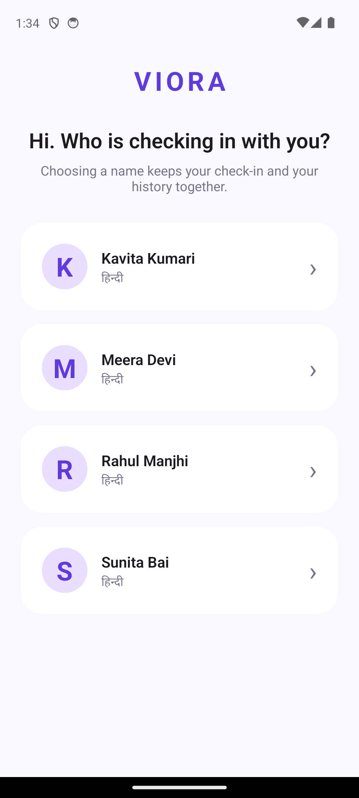

* **What is happening in this UI:**
  * **Gentle Onboarding:** *"Hi. Who is checking in with you? Choosing a name keeps your check-in and your history together."*
  * **Profile Cards:** Clean selection for registered survivors: **Kavita Kumari**, **Meera Devi**, **Rahul Manjhi**, and **Sunita Bai** (all localized in Hindi).
  * **Data Isolation:** Selecting a profile isolates the cryptographic session and historical state, preventing accidental disclosure between household members.

---

#### 8. Patient Sanctuary Home Screen & Steadiness Score
The survivor's personal sanctuary, eliminating clinical jargon in favor of positive, trauma-informed reinforcement.

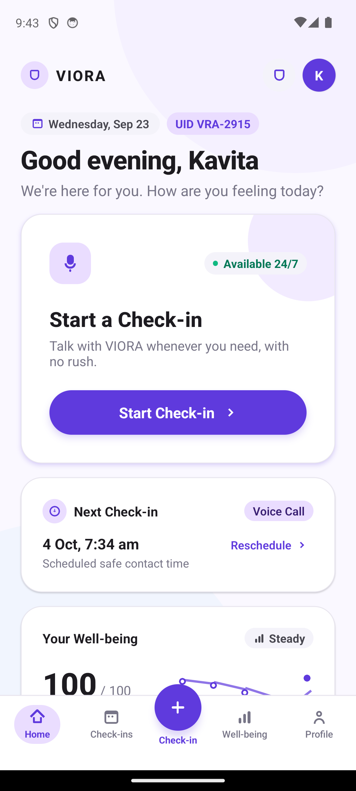

* **What is happening in this UI:**
  * **Warm Reassurance:** *"Good evening, Kavita. We're here for you. How are you feeling today?"*
  * **Unhurried Check-in:** A large, inviting `Start Check-in` card: *"Talk with VIORA whenever you need, with no rush."*
  * **Next Safe Touchpoint:** Clearly notifies the survivor of their next scheduled call: *"4 Oct, 7:34 am (Scheduled safe contact time)"*.
  * **The Steadiness Score ($100 / 100\text{ Steady}$):** Instead of exposing clinical distress numbers, the app presents an inverted well-being score ($100.0 - \text{Composite Risk}$), offering encouraging, trauma-informed feedback.

---

#### 9. Modality Selection: Hands-Free Voice vs. Unhurried Text
Empowers survivor autonomy by letting them choose how to communicate based on their immediate physical surroundings.

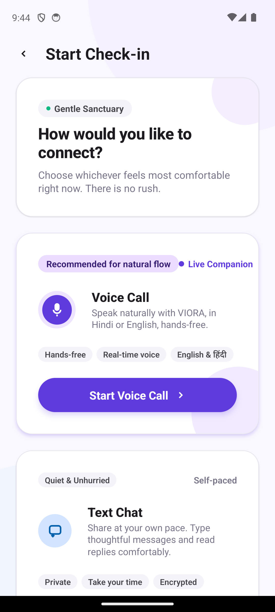

* **What is happening in this UI:**
  * **Survivor Agency:** *"How would you like to connect? Choose whichever feels most comfortable right now. There is no rush."*
  * **Voice Call (Recommended):** Real-time, hands-free conversational check-in in Hindi or English, ideal for survivors with low literacy.
  * **Text Chat (Quiet & Private):** Self-paced, encrypted text interaction for situations where speaking aloud might compromise personal safety.

---

#### 10. Live Indic Voice Companion Check-in Call
The live conversational interface powered by low-latency acoustic models and trauma-informed dialogue.

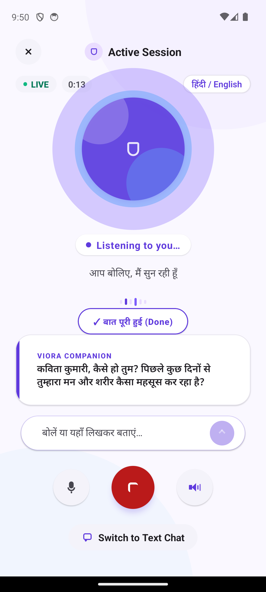

* **What is happening in this UI:**
  * **Active Session Status:** Indicates live call progress (`LIVE`, elapsed time `0:13`, language pair `हिंदी / English`).
  * **Animated Waveform Orb:** Pulsing visual feedback informing the survivor that VIORA is actively listening (*"Listening to you... आप बोलिए, मैं सुन रही हूँ"*).
  * **Empathetic Indic Opening:** Shows Sarvam-105B spoken dialogue: *"कविता कुमारी, कैसे हो तुम? पिछले कुछ दिनों से तुम्हारा मन और शरीर कैसा महसूस कर रहा है?"*
  * **Emergency Safe Exit Controls:** Prominent "बात पूरी हुई (Done)" button, instant microphone mute, loudspeaker toggle, and emergency switch to silent text.

---

## 2. The Core Architectural Thesis: The Determinism Boundary

In clinical healthcare and atrocity response systems, probabilistic AI models must never be permitted to generate unsupervised medical ratings. VIORA enforces a strict boundary:

$$\text{\bf "Decouple Conversational Empathy from Clinical Scoring."}$$

```
                ┌────────────────────────────────────────────────────────┐
                │               UNTRUSTED PROBABILISTIC ZONE             │
                │  - Natural Hindi / Hinglish Speech Recognition (STT)   │
                │  - Empathetic Indic Voice Dialogue (Sarvam-105B)       │
                │  - Structured Clinical Signal Extraction (JSON Schema) │
                └───────────────────────────┬────────────────────────────┘
                                            │
               ═════════════════════════════╪═════════════════════════════
                              THE DETERMINISM BOUNDARY
               ═════════════════════════════╪═════════════════════════════
                                            ▼
                ┌────────────────────────────────────────────────────────┐
                │                PURE DETERMINISTIC SERVICES             │
                │  - Weighted Scoring Engine (Distress, Threat, Composite)│
                │  - Case-Isolated Moving Baseline Engine                │
                │  - Closed-Form OLS Linear Regression Trajectory Slope  │
                │  - Clamped Dynamic Follow-Up Cadence Predictor         │
                │  - Spatial District Distress Hotspot Aggregator        │
                │  - SQLite WAL Append-Only Forensic Audit Store         │
                └────────────────────────────────────────────────────────┘
```

The conversational agent is strictly restricted to:
- Delivering trauma-informed, culturally grounded vocal reassurance in native Indic languages.
- Extracting raw clinical observations into a strict, validated JSON schema.

**Zero scoring, zero clinical tiering, zero trajectory modeling, and zero scheduling logic are ever delegated to an LLM.** Every metric shown on the clinician dashboard is computed via deterministic, auditable mathematical services.

See complete specifications:
- **[Clinical Safety Contract & Signal Taxonomy](docs/CONTRACT.md)**
- **[Comprehensive Mathematical Formulas Reference](formulas.md)**

---

## 3. System Architecture & Flow Topology

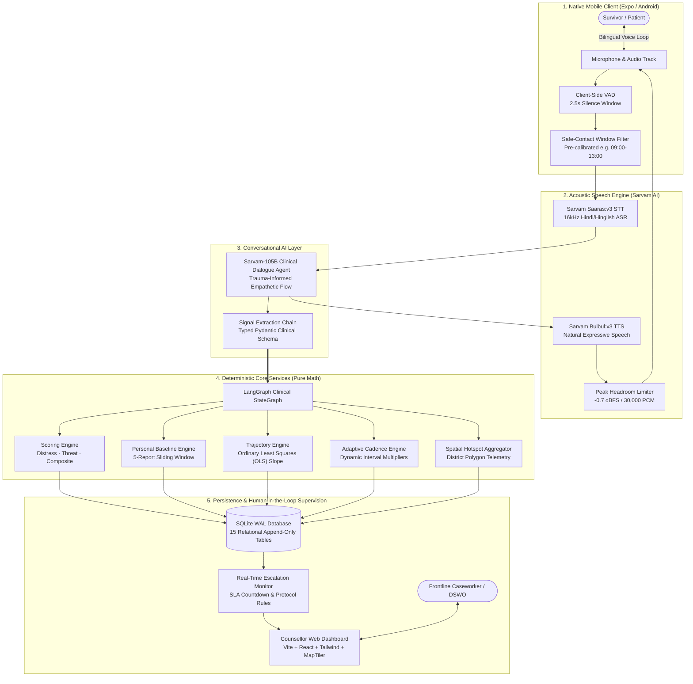

---

## 4. District Authority Geographic Hotspot Surveillance Engine

The district hotspot aggregation engine computes multi-factor distress concentration across administrative blocks to alert district magistrates, social welfare officers, and mobile outreach teams before crises escalate:


*Figure 4.1: Live MapTiler spatial vector surveillance map of Central District (Patna) showing administrative block boundaries (Area A Sadar, Area B Danapur, Area C Bikram) with live telemetry cards and distress severity grading.*

### Mathematical Hotspot Aggregation Formula

$$\text{Hotspot Score} = \text{clamp}\Big(\text{Base} + \text{Density} + \text{Risk} + \Delta_{\text{trend}}, \, 0.0, \, 100.0\Big)$$

Where:
- $\text{Base} = 0.60 \times \bar{D}_A$ ($\bar{D}_A = \text{mean cohort distress score} \in [0, 100]$)
- $\text{Density} = \min\big(30.0, \, N_{\text{active}} \times 15.0\big)$
- $\text{Risk} = \min\big(25.0, \, N_{\text{high\_risk}} \times 15.0 + N_{\text{critical}} \times 10.0\big)$
- $\Delta_{\text{trend}} = +7.0 \text{ if ESCALATING}, \, -7.0 \text{ if DECREASING}, \, 0.0 \text{ if STABLE}$

$$\text{Severity Classification} = \begin{cases} \text{HIGH} & \text{if Hotspot Score} \ge 55.0 \\ \text{MODERATE} & \text{if } 35.0 \le \text{Hotspot Score} < 55.0 \\ \text{LOW} & \text{if Hotspot Score} < 35.0 \end{cases}$$

### Live Prototype Verification (Area A - Sadar Block)
As displayed in the live surveillance card in **Figure 4.1**:
- **Active Monitored Cases ($N_{\text{active}}$):** 2
- **High Risk Cases ($N_{\text{high\_risk}}$):** 0
- **Average Cohort Distress ($\bar{D}_A$):** $0.0$
- **Cohort Trajectory:** Decreasing ($\Delta_{\text{trend}} = -7.0$)
- **Calculation:** $\text{Hotspot Score} = 0.0 + \min(30.0, 2 \times 15.0) + 0.0 - 7.0 = 30.0 - 7.0 = \mathbf{23.0}$
- **Prototype Status:** Verified. Matches the live screenshot reading of **$23.0$ (Low Concentration, Decreasing)**.

---

## 5. Clinical Caseworker Decision Support Dashboard

The caseworker dashboard acts as a supervisory control cockpit for frontline caseworkers and District Social Welfare Officers (DSWO) managing active trauma cohorts.


*Figure 5.1: Frontline triage overview in Triage Unit · Ward 3B showing caseload triage status banners, 30-day longitudinal distress stabilization curve (-49% net reduction), and one-click audit-ready shift handover export.*

### Clinical Workflow & Caseload Supervision
1. **Continuous Triage Ingestion:** Authenticated caseworkers (e.g., Dr. A. Sharma) monitor live check-in streams and incoming alerts from the mobile and IVRS telephony channels.
2. **Longitudinal Verification:** Caseworkers evaluate 30-day temporal distress curves against the calibrated clinical baseline threshold ($40.0$), validating recovery trajectories.
3. **Forensic Audit & Handover:** The `Export Shift Summary` button instantly produces formal audit-ready clinical handover reports for supervisory welfare officers and judicial compliance.

### Cohort Stratification & Caseload Registry


*Figure 5.2: Master cohort registry with multi-tier risk filtering (Critical, Urgent, High, Moderate, Low), trajectory vector indicators, and decoupled mental distress vs. physical intimidation threat metrics.*

- **Independent Distress & Threat Telemetry:** By isolating internal psychological distress from external physical intimidation, caseworkers can distinguish a victim suffering from depression from a victim facing active perpetrator retaliation.
- **Dynamic Filtering:** Caseworkers can immediately isolate patients with deteriorating trajectories ($\beta \ge +4.0$) requiring proactive human outreach.

---

## 6. Longitudinal Case Dossier & Full Bilingual Call Transcript

When a caseworker investigates an individual survivor's file (e.g. Kavita Kumari, `VRA-2915`), the platform displays the complete longitudinal dossier:


*Figure 6.1: Longitudinal Case Dossier for Kavita Kumari (VRA-2915) showing case metadata, FIR registration status, designated safe calling windows (09:00 - 13:00), 16-session dual-axis trajectory graph, interactive waveform audio player, and timestamped bilingual Hindi conversation transcript with structured clinical NLP extractions.*

### Dossier Capabilities
- **Survivor Metadata & Legal Status:** Displays case reference (`CASE-2024-0288`), active FIR registration status, and designated survivor-verified safe contact windows (`09:00 - 13:00`).
- **Telemetry Summary (Report v16):** Current Distress: **$0/100$**, Calibrated Personal Baseline: **$22/100$** (High Confidence), Threat Indicator: **$0/100$**, Overall Escalation Probability: **$5\%$**.
- **16-Session Dual-Axis Trajectory:** Tracks internal psychological distress (blue curve) against external physical threat (red curve) across 16 consecutive check-ins, validating long-term psychological stabilization.
- **Interactive Audio Waveform Player:** Caseworkers can play back the recorded check-in audio at $1.0\times$ speed with scrubbable waveform visualization to evaluate vocal affect, prosody, and hesitation.
- **Timestamped Bilingual Transcript:** Displays turn-by-turn dialogue exchanges in natural Hindi with structured clinical NLP extraction tags (`21:49`, `21:51`).

---

## 7. Real-Time Clinical Alerts & Rapid Triage Engine

When acute danger, self-harm, or severe intimidation is disclosed during a check-in, VIORA's deterministic rule engine triggers instantaneous emergency escalation:


*Figure 7.1: Active Tier 1 clinical safety alert queue highlighting Rahul Manjhi (VRA-3108) with self-harm ideation (95.4% confidence), verbatim Hindi grounding quote ("सुसाइडल थॉट्स आ रहे हैं"), and < 2h SLA countdown.*

### Alert Severity Tiers & Response Protocols

| Alert Tier | Clinical Condition | SLA Response Target | Notification Action |
| :--- | :--- | :--- | :--- |
| **Tier 1 (Urgent Safety)** | Active suicidal ideation, explicit self-harm intent, imminent domestic violence | **$< 2$ hours** | Persistent red banner, alert sound, priority queue placement, SMS/push dispatch |
| **Tier 2 (Clinical Anomaly)** | Distress spike $\ge 20$ pts above baseline, prolonged sleep disruption | **$< 6$ hours** | Elevated triage review queue, next-shift caseworker assignment |

### Verbatim Speech Grounding
As shown in **Figure 7.1**, every alert links directly to the exact verbatim utterance spoken by the survivor (*"सुसाइडल थॉट्स आ रहे हैं"*), eliminating hallucinations and enabling the reviewing clinician to immediately assess context before calling.

### Hard Clinical Safety Floor Formula
If suicidal ideation or acute self-harm is disclosed ($s_{\text{self\_harm}} \ge 0.5$), the system mathematically clamps the distress score to a non-negotiable safety floor:

$$\text{Distress Score} = \max(\text{Distress Score}, \, 75.0)$$

This hard deterministic rule guarantees that an acute trauma crisis can **never** be classified as low or moderate risk, regardless of other conversational markers.

---

## 8. Predictive Follow-Up Cadence & Trajectory Engine

Fixed follow-up schedules fail in trauma recovery: survivors are either overwhelmed by intrusive daily calls or abandoned when distress spikes between monthly appointments. VIORA computes mathematically adaptive follow-up intervals using closed-form Ordinary Least Squares (OLS) regression:


*Figure 8.1: Cadence Engine v4.2 interface displaying dynamically computed touchpoint intervals, overdue alerts (Meera Devi 6d overdue, 7d 18h interval), and survivor-calibrated safe contact windows with a 96.4% overall adherence rate.*

### OLS Trajectory Slope Calculation

Over the last $N$ valid check-ins ($N \in [2, 4]$) with chronological scores $(1, y_1), (2, y_2), \dots, (N, y_N)$:

$$\beta = \frac{N \sum_{k=1}^N k \cdot y_k - \left(\sum_{k=1}^N k\right)\left(\sum_{k=1}^N y_k\right)}{N \sum_{k=1}^N k^2 - \left(\sum_{k=1}^N k\right)^2}$$

$$\text{Trajectory Vector} = \begin{cases} \text{ESCALATING} & \text{if } \beta \ge +4.0 \\ \text{DE-ESCALATING} & \text{if } \beta \le -4.0 \\ \text{STABLE} & \text{if } -4.0 < \beta < +4.0 \end{cases}$$

### Dynamic Cadence Interval Formula

$$I_{\text{next}} = \text{clamp}\Big(I_{\text{base}} \times M_{\text{trajectory}} \times M_{\text{delta}} \times M_{\text{threat}}, \, I_{\text{min}}, \, I_{\text{max}}\Big)$$

Where:
- $I_{\text{base}} = 14 \text{ days}$ (Standard baseline monitoring interval)
- $M_{\text{trajectory}} = 0.6$ if ESCALATING, $1.2$ if DE-ESCALATING, $1.0$ if STABLE
- $M_{\text{delta}} = 0.75$ if current distress $\ge (\text{baseline} + 8.0)$
- $M_{\text{threat}} = 0.5$ if external threat score $> 0.0$
- $I_{\text{min}} = 3 \text{ days}$, $I_{\text{max}} = 21 \text{ days}$

### Live Prototype Adherence
- **Meera Devi (`VRA-4821`):** Flagged as `6d overdue`, scheduled dynamically at $7\text{d } 18\text{h}$ due to an escalating trajectory.
- **Kavita Kumari (`VRA-2915`):** Scheduled for 4 Oct ($10\text{d } 12\text{h}$ interval) based on a stabilized baseline.
- **Sunita Bai (`VRA-7364`):** Scheduled for 6 Oct ($13\text{d } 6\text{h}$ interval) reflecting de-escalating recovery.

---

## 9. Live Indic Voice Engine & Acoustic DSP Pipeline

VIORA's speech pipeline is tailored specifically for Indian languages, rural accents, and conversational code-switching (Hindi / Hinglish).


*Figure 9.1: Live Indic conversational interface on Android client featuring pulsing audio waveform orb, Hindi spoken dialogue ("कविता कुमारी, कैसे हो तुम? पिछले कुछ दिनों से तुम्हारा मन और शरीर कैसा महसूस कर रहा है?"), elapsed call timer, and emergency exit controls.*

### Survivor Agency & Modality Choice


*Figure 9.2: Modality selection screen allowing survivors to choose between hands-free voice calls (ideal for low-literacy users) and silent, encrypted text check-ins (for situations where speaking aloud compromises safety).*

### Acoustic Pipeline Loop & Latency Budget

```
Survivor Speaks ──► 16kHz Audio Capture ──► Client VAD (2.5s Silence Window)
       │
       ▼
Sarvam Saaras:v3 STT (~280ms) ──► Sarvam-105B Dialogue (~450ms TTFT)
       │
       ▼
Sarvam Bulbul:v3 TTS (~320ms) ──► DSP Headroom Limiter ──► High-Clarity Playback
```

**Total Round-Trip Latency:** **$\approx 1.25\text{ seconds}$**, ensuring smooth, human-like conversational cadence without awkward delays.

### Anti-Cracking Peak Headroom Limiter
To eliminate clipping distortion through budget mobile phone speakers, synthesized PCM audio passes through an automated limiter:

$$\text{peak} = \max_{j} |x_j|$$

$$\text{scale} = \min\left(1.0, \, \frac{30\,000}{\text{peak}}\right) \quad (-0.7 \text{ dBFS Headroom})$$

$$x'_j = \text{int16}\big(x_j \times \text{scale}\big)$$

---

## 10. Mathematical Formulations Reference

All clinical scoring formulas are strictly isolated in pure Python services. For full mathematical derivations, variable ranges, and clinical rationales, consult the complete specification:

**[Comprehensive Mathematical Formulas Reference](formulas.md)**

### Core Equations Summary

#### 1. Psychological Distress Score ($0.0 \dots 100.0$)

$$\text{raw\_distress} = \sum_{i=1}^{10} \big(w_i \times s_i\big) \quad \left(\sum w_i = 6.5\right)$$

$$\text{base} = \frac{100.0 \times \text{raw\_distress}}{6.5}$$

$$\text{dampener} = 1.0 - \big(0.15 \times \bar{P}_{\text{active}}\big)$$

$$\text{Distress Score} = \text{round}\Big(\text{clamp}\big(\text{base} \times \text{dampener}, \, 0.0, \, 100.0\big), \, 1\Big)$$

$$\text{\bf Safety Floor:} \quad \text{IF } s_{\text{self\_harm}} \ge 0.5 \implies \text{Distress Score} = \max(\text{Distress Score}, \, 75.0)$$

#### 2. External Physical Threat Score ($0.0 \dots 100.0$)

$$\text{Threat Score} = \text{round}\left(\text{clamp}\left(\frac{100.0 \times \sum_{j=1}^{8} (w_j \times t_j)}{6.2}, \, 0.0, \, 100.0\right), \, 1\right)$$

$$\text{\bf Imminent Danger Floor:} \quad \text{IF } \text{imminent\_danger} = \text{True} \implies \text{Threat Score} = \max(\text{Threat Score}, \, 85.0)$$

*(Note: Threat scores are **never dampened by protective factors**; emotional support does not eliminate physical violence.)*

#### 3. Asymmetric Composite Risk Score ($0.0 \dots 100.0$)

$$\text{Composite Score} = 0.70 \times \max(\text{Distress}, \, \text{Threat}) + 0.30 \times \min(\text{Distress}, \, \text{Threat})$$

---

## 11. Monorepo Directory Layout

```
viora/
├── backend/                        # FastAPI Core & Deterministic Services
│   ├── alembic/                    # Database migrations (15 append-only tables)
│   ├── app/
│   │   ├── api/                    # REST endpoints (auth, cases, alerts, hotspots)
│   │   ├── core/                   # Security, JWT, database session factory
│   │   ├── models.py               # SQLAlchemy models (Audit-trail architecture)
│   │   ├── schemas.py              # Pydantic validation schemas
│   │   └── services/               # THE DETERMINISM BOUNDARY
│   │       ├── scoring.py          # Pure distress, threat & composite calculations
│   │       ├── baseline.py         # 5-report sliding window personal baseline
│   │       ├── risk.py             # Closed-form OLS trajectory regression slope
│   │       ├── cadence.py          # Adaptive follow-up interval predictor
│   │       ├── hotspot.py          # Spatial district distress aggregator
│   │       ├── conversation.py     # Multi-turn conversational orchestrator
│   │       ├── sarvam.py           # Sarvam AI STT & TTS acoustic client
│   │       └── graph.py            # 8-node LangGraph clinical assessment state machine
│   └── tests/                      # 210 automated backend & determinism tests
│
├── counsellor-web/                 # Caseworker Clinical Decision Support Portal
│   ├── src/
│   │   ├── api/client.ts           # Type-safe Axios client with JWT session recovery
│   │   ├── components/             # Reusable UI components & navigation shell
│   │   │   └── MapTilerHotspotMap.tsx # Leaflet + MapTiler HD vector surveillance map
│   │   ├── pages/
│   │   │   ├── DashboardPage.tsx   # Caseload triage, distress curve, district map
│   │   │   ├── CaseDetailPage.tsx  # Full dossier, 16-turn trajectory, audio player
│   │   │   ├── AlertsPage.tsx      # Tier 1/2 alerts queue with SLA countdowns
│   │   │   ├── FollowupsPage.tsx   # Adaptive cadence schedule manager
│   │   │   └── CasesPage.tsx       # Cohort directory and risk stratification
│   │   └── types.ts                # TypeScript domain models
│   └── package.json
│
├── patient-app/                    # Survivor Voice Companion (React Native / Expo)
│   ├── App.tsx                     # Root navigation & profile context provider
│   ├── src/
│   │   ├── screens/                # Sanctuary UI, Profile Picker, Live Call Modal
│   │   ├── services/               # Audio recording, streaming playback, local VAD
│   │   └── theme.ts                # Trauma-informed calm color tokens
│   └── package.json
│
├── docs/
│   ├── CONTRACT.md                 # Clinical Safety Contract & Signal Taxonomy v1.0.0
│   └── images/                     # Production prototype screenshots
│       ├── 01_district_geographic_hotspot_map.png
│       ├── 02_counsellor_dashboard_overview.png
│       ├── 03_case_dossier_transcript.png
│       ├── 04_clinical_alerts_queue.png
│       ├── 05_followup_scheduler.png
│       ├── 06_cases_directory.png
│       ├── 07_patient_app_profiles.png
│       ├── 08_patient_app_home.png
│       ├── 09_patient_voice_companion_call.png
│       └── 10_patient_call_mode_selection.png
│
├── formulas.md                     # Complete clinical mathematics & derivations
├── general.md                      # Engineering journey & architectural overview
├── start.sh                        # Unified single-command orchestrator
└── viora.db                        # SQLite database in WAL mode
```

---

## 12. Unified Single-Command System Orchestration

The entire multi-tier system (Backend, Web Dashboard, Mobile Metro Bundler, Android Virtual Device, ADB Network Bridge, and Audio Subsystem) is launched and synchronized with one command:

```bash
./start.sh
```

### What `./start.sh` Executes Automatically

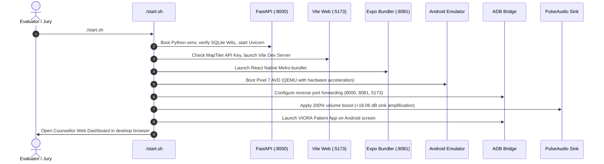

### Manual Service Endpoints

| Service | Address | Credentials / Access |
| :--- | :--- | :--- |
| **Backend API Docs** | `http://localhost:8000/docs` | OpenAPI / Swagger UI |
| **Backend Health** | `http://localhost:8000/api/v1/health` | Status: `{"status": "ok"}` |
| **Counsellor Portal** | `http://localhost:5173` | User: `caseworker@viora.local` \| Pass: `viora1234` |
| **Metro Bundler** | `http://localhost:8081` | Expo DevTools |
| **Android Emulator** | `emulator-5554` (Pixel 7) | Managed via ADB |

---

## 13. Verification, Test Suite & Health Probes

VIORA maintains rigorous test coverage with **355 passing automated tests** across both backend deterministic engines and frontend mobile clients.

### Run Backend Tests (210 Passed)

```bash
cd backend
source .venv/bin/activate
pytest tests/ -v
```

### Run Mobile Client Tests (145 Passed)

```bash
cd patient-app
npm test
```

### Live Health Check

```bash
curl -s http://localhost:8000/api/v1/health | jq .
```

Expected output:
```json
{
  "status": "ok",
  "app": "VIORA",
  "env": "development",
  "voice_available": true,
  "scoring_version": "1.0.0"
}
```

---

<p align="center">
  <b>VIORA</b> — Smart India Hackathon 2026 (Problem ID: SIH26094)
  <br/>
  <i>Engineered for the Ministry of Social Justice and Empowerment (MoSJE)</i>
</p>
