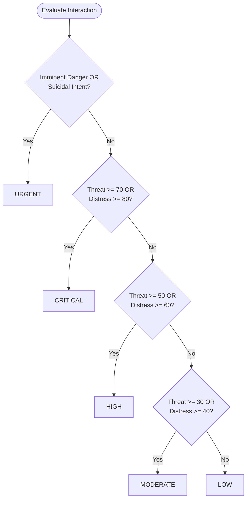

# VIORA System Formulas Reference

> **Document Type:** Clinical Mathematics, Scoring Specifications & Threshold Algorithms  
> **Target Audience:** Engineering Team, Evaluation Jury, Clinical Assessors  
> **Platform:** VIORA — Trauma-Informed Conversational AI & Follow-up Platform  
> **Source Directory:** [`backend/app/services/`](backend/app/services/)

---

## Table of Contents
1. [Distress Score Formula](#1-distress-score-formula)
2. [Threat Score Formula](#2-threat-score-formula)
3. [Composite Score Formula](#3-composite-score-formula)
4. [Clinical Risk Banding Rules](#4-clinical-risk-banding-rules)
5. [Personal Baseline & Deviation Formula](#5-personal-baseline--deviation-formula)
6. [Trend & Step-Change (Delta) Formula](#6-trend--step-change-delta-formula)
7. [Least-Squares Trajectory Slope Formula](#7-least-squares-trajectory-slope-formula)
8. [Escalation Risk Percentage Formula](#8-escalation-risk-percentage-formula)
9. [Engagement Decline / Withdrawal Detection](#9-engagement-decline--withdrawal-detection)
10. [Adaptive Follow-Up Cadence Prediction](#10-adaptive-follow-up-cadence-prediction)
11. [Scheduler Overdue & Grace Period Formula](#11-scheduler-overdue--grace-period-formula)
12. [Survivor Safe-Contact Window Validation](#12-survivor-safe-contact-window-validation)
13. [Patient Steadiness Score (Inverted Composite)](#13-patient-steadiness-score-inverted-composite)
14. [Audio Peak Headroom Limiter (Anti-Cracking)](#14-audio-peak-headroom-limiter-anti-cracking)
15. [Voice Activity Detection (VAD) Silence Threshold](#15-voice-activity-detection-vad-silence-threshold)

---

## 1. Distress Score Formula

### What This Formula Is Used For
Calculates the patient's internal psychological distress score ($0.0$ to $100.0$) from conversational signals. The raw weighted sum is normalized to a 100-point scale, tempered by present protective support factors, and governed by a hard clinical safety floor if self-harm ideation is disclosed.

### The Mathematical Formula

$$\text{raw\_distress} = \sum_{i} \left( \text{weight}_i \times \text{signal\_intensity}_i \right)$$

$$\text{base\_distress} = \frac{100.0 \times \text{raw\_distress}}{6.5}$$

$$\text{protective\_dampener} = 1.0 - \left(0.15 \times \text{mean\_present\_protective\_intensity}\right)$$

$$\text{distress\_score} = \text{round}\Big(\text{clamp}\big(\text{base\_distress} \times \text{protective\_dampener}, \, 0.0, \, 100.0\big), \, 1\Big)$$

$$\text{Clinical Floor:} \quad \text{IF } \text{self\_harm\_ideation} \ge 0.5 \implies \text{distress\_score} = \max(\text{distress\_score}, \, 75.0)$$

### Variable & Term Definitions
| Variable | Range / Type | Clinical Definition |
| :--- | :--- | :--- |
| `raw_distress` | $\ge 0.0$ (Float) | The unnormalized cumulative weighted score of all distress signals. |
| `weight_i` | $0.4 \dots 1.0$ | Severity weight assigned to clinical distress indicator $i$ (Total sum = $6.5$). |
| `signal_intensity_i` | $0.0 \dots 1.0$ | Continuous intensity extracted by NLP ($0.0$ = absent, $0.5$ = moderate, $1.0$ = acute). |
| `base_distress` | $0.0 \dots 100.0$ | Distress score normalized to standard percentage scale before protective adjustment. |
| `protective_dampener`| $0.85 \dots 1.0$ | Multiplier providing up to a $15\%$ discount when positive support systems are active. |
| `mean_present_protective_intensity` | $0.0 \dots 1.0$ | Average intensity of active protective factors. If none present, dampener is $1.0$. |
| `self_harm_ideation` | $0.0 \dots 1.0$ | Intensity of self-harm expressions. If $\ge 0.5$, activates the $75.0$ safety floor. |

#### Distress Weights Breakdown ($\sum = 6.5$)
- `hopelessness`: **$1.0$** (Severe depression marker)
- `self_harm_ideation`: **$1.0$** (Acute clinical suicide risk)
- `anxiety_fear`: **$0.8$** (Acute panic / trauma anxiety)
- `sadness_low_mood`: **$0.7$** (Depressive affect)
- `sleep_disturbance`: **$0.6$** (Insomnia / trauma nightmares)
- `social_withdrawal`: **$0.6$** (Isolation from support networks)
- `shame_stigma`: **$0.5$** (Internalized GBV guilt / stigma)
- `anger_irritability`: **$0.5$** (Trauma hyperarousal)
- `appetite_change`: **$0.4$** (Somatic appetite disruption)
- `somatic_complaints`: **$0.4$** (Stress-induced headaches, aches)

**Code Location:** [`backend/app/services/scoring.py`](backend/app/services/scoring.py#L66) (`distress_score`, `protective_dampener`)

---

## 2. Threat Score Formula

### What This Formula Is Used For
Quantifies external physical danger, intimidation, and environmental threats ($0.0$ to $100.0$). Crucially, this score is **never dampened by protective factors** because emotional support does not reduce physical violence from an abuser.

### The Mathematical Formula

$$\text{raw\_threat} = \sum_{i} \left( \text{weight}_i \times \text{signal\_intensity}_i \right)$$

$$\text{threat\_score} = \text{round}\left( \text{clamp}\left( \frac{100.0 \times \text{raw\_threat}}{6.2}, \, 0.0, \, 100.0 \right), \, 1 \right)$$

$$\text{Crisis Floor:} \quad \text{IF } \text{imminent\_danger} = \text{True} \implies \text{threat\_score} = \max(\text{threat\_score}, \, 85.0)$$

### Variable & Term Definitions
| Variable | Range / Type | Clinical Definition |
| :--- | :--- | :--- |
| `raw_threat` | $\ge 0.0$ (Float) | Unnormalized cumulative weighted score of all external physical threat signals. |
| `weight_i` | $0.5 \dots 1.0$ | Danger weight assigned to threat indicator $i$ (Total sum = $6.2$). |
| `signal_intensity_i` | $0.0 \dots 1.0$ | Severity of disclosed threat ($0.0$ = absent, $1.0$ = acute). |
| `6.2` | Constant | The maximum possible threat weight sum used to normalize the score to $0\dots100$. |
| `imminent_danger` | Boolean | True if physical violence is actively occurring or threatened immediately. Floored at $85.0$. |

#### Threat Weights Breakdown ($\sum = 6.2$)
- `direct_threat_received`: **$1.0$** (Direct verbal or physical death/violence threats)
- `new_incident_reported`: **$1.0$** (New assault, battery, or harassment event)
- `intimidation_pressure`: **$0.9$** (Stalking, witness tampering, coercion)
- `unsafe_at_home`: **$0.9$** (Active fear living under the same roof as the abuser)
- `perpetrator_proximity`: **$0.8$** (Abuser sighted nearby or in the village)
- `social_boycott`: **$0.6$** (Ostracization by community or in-laws)
- `institutional_inaction`: **$0.5$** (Police or local authorities refusing protection)
- `economic_coercion`: **$0.5$** (Deprivation of food, money, or shelter)

**Code Location:** [`backend/app/services/scoring.py`](backend/app/services/scoring.py#L80) (`threat_score`)

---

## 3. Composite Score Formula

### What This Formula Is Used For
Generates an asymmetric weighted blend ($0.0$ to $100.0$) of internal distress and external threat. The worse axis receives a dominant $70\%$ weighting so acute danger is never diluted by emotional composure.

### The Mathematical Formula

$$\text{hi} = \max(\text{distress\_score}, \, \text{threat\_score})$$

$$\text{lo} = \min(\text{distress\_score}, \, \text{threat\_score})$$

$$\text{composite\_score} = \text{round}(0.7 \times \text{hi} + 0.3 \times \text{lo}, \, 1)$$

### Variable & Term Definitions
| Variable | Range / Type | Clinical Definition |
| :--- | :--- | :--- |
| `distress_score` | $0.0 \dots 100.0$ | Measured psychological distress score. |
| `threat_score` | $0.0 \dots 100.0$ | Measured external danger score. |
| `hi` | $0.0 \dots 100.0$ | The maximum of the two scores (the worse axis). |
| `lo` | $0.0 \dots 100.0$ | The minimum of the two scores. |
| $0.7 \times \text{hi}$ | $70\%$ Weight | Dominant weighting preventing high physical threat from being masked by calm affect. |
| $0.3 \times \text{lo}$ | $30\%$ Weight | Secondary axis contribution. |
| `composite_score`| $0.0 \dots 100.0$ | Final blended metric for trajectory analysis and patient steadiness. |

**Code Location:** [`backend/app/services/scoring.py`](backend/app/services/scoring.py#L95) (`composite_score`)

---

## 4. Clinical Risk Banding Rules

### What This Formula Is Used For
Maps the patient's scores into one of five clinical priority tiers. Threat thresholds are intentionally lower than distress thresholds so physical danger escalates even if the person speaks calmly.

### The Decision Logic

### Risk Tiers Overview
| Band | Trigger Condition | Action & Required Cadence |
| :--- | :--- | :--- |
| **URGENT** | `imminent_danger` OR `suicidal_intent` | Immediate mid-call caseworker alert + follow-up in **12h–24h** |
| **CRITICAL** | `threat_score` $\ge 70$ OR `distress_score` $\ge 80$ | High-priority dashboard escalation + follow-up in **12h–48h** |
| **HIGH** | `threat_score` $\ge 50$ OR `distress_score` $\ge 60$ | Early caseworker intervention + follow-up in **1d–4d** |
| **MODERATE** | `threat_score` $\ge 30$ OR `distress_score` $\ge 40$ | Closer monitoring + follow-up in **2d–10d** |
| **LOW** | All scores below moderate thresholds | Routine monitoring + follow-up in **4d–14d** |

**Code Location:** [`backend/app/services/risk.py`](backend/app/services/risk.py#L46) (`band`)

---

## 5. Personal Baseline & Deviation Formula

### What This Formula Is Used For
Calculates an individualized normative distress score from the patient's own history (sliding window of up to 5 prior reports). VIORA rejects population-wide averages: every survivor is their own control.

### The Mathematical Formula

$$\text{window} = [p_1, p_2, \dots, p_n] \quad \text{where } n \le 5$$

$$\text{IF } n = 0 \implies \text{baseline} = \text{round}(\text{current\_distress}, 1), \quad \text{confidence} = \text{"NONE"}, \quad \text{deviation} = 0.0$$

$$\text{IF } n \ge 1 \implies \text{baseline} = \text{round}\left( \frac{1}{n} \sum_{i=1}^{n} p_i, \, 1 \right), \quad \text{deviation} = \text{round}(\text{current\_distress} - \text{baseline}, \, 1)$$

### Confidence Mapping
- $n = 0$: `confidence = "NONE"` (First interaction)
- $n = 1$: `confidence = "LOW"`
- $2 \le n \le 4$: `confidence = "MEDIUM"`
- $n \ge 5$: `confidence = "HIGH"` (Fully established baseline)

**Code Location:** [`backend/app/services/baseline.py`](backend/app/services/baseline.py#L36) (`compute_baseline`)

---

## 6. Trend & Step-Change (Delta) Formula

### What This Formula Is Used For
Measures the acute step-change difference between the current check-in and the immediately preceding check-in.

### The Mathematical Formula

$$\Delta = \text{change} = \text{round}(\text{current\_distress} - \text{previous\_distress}, \, 1)$$

$$\text{trend} = \begin{cases} 
\text{"WORSENING"} & \text{if } \Delta \ge +8.0 \\
\text{"IMPROVING"} & \text{if } \Delta \le -8.0 \\
\text{"STABLE"} & \text{if } -8.0 < \Delta < +8.0 \\
\text{"INSUFFICIENT\_DATA"} & \text{if no prior report exists}
\end{cases}$$

> [!NOTE]
> The $\pm 8.0$ threshold (`TREND_DELTA`) filters out everyday emotional noise so caseworkers only see alerts when genuine psychological movement occurs.

**Code Location:** [`backend/app/services/baseline.py`](backend/app/services/baseline.py#L74) (`compute_trend`)

---

## 7. Least-Squares Trajectory Slope Formula

### What This Formula Is Used For
Computes the linear rate of distress acceleration over the last 4 check-in points (up to 3 prior reports + current report) using closed-form Ordinary Least Squares (OLS) regression.

### The Mathematical Formula

$$\bar{x} = \frac{n - 1}{2}, \quad \bar{y} = \frac{1}{n} \sum_{i=0}^{n-1} y_i$$

$$\text{slope} = \frac{\sum_{i=0}^{n-1} (i - \bar{x})(y_i - \bar{y})}{\sum_{i=0}^{n-1} (i - \bar{x})^2} \quad (\text{for } n \ge 3; \text{ else } 0.0)$$

$$\text{direction} = \begin{cases} 
\text{"ESCALATING"} & \text{if } \text{slope} \ge +4.0 \\
\text{"DE\_ESCALATING"} & \text{if } \text{slope} \le -4.0 \\
\text{"STABLE"} & \text{if } -4.0 < \text{slope} < +4.0 \\
\text{"INSUFFICIENT\_DATA"} & \text{if } n < 3
\end{cases}$$

### Variable & Term Definitions
- $y_i$: Distress score at sequential check-in index $i \in \{0, \dots, n-1\}$.
- $n$: Window sample size ($3 \le n \le 4$).
- $\bar{x}$: Midpoint of time indices.
- $\bar{y}$: Mean distress score across the window.
- $\text{slope}$: Rate of distress change in points per check-in.
- $\pm 4.0$: Trajectory threshold (`SLOPE_ESCALATING`).

**Code Location:** [`backend/app/services/risk.py`](backend/app/services/risk.py#L59) (`_least_squares_slope`, `predict`)

---

## 8. Escalation Risk Percentage Formula

### What This Formula Is Used For
Generates a $0.0\%$ to $100.0\%$ probability index for caseworkers, forecasting the likelihood of severe escalation over the next two check-ins.

### The Mathematical Formula

$$\text{slope\_contrib} = \text{clamp}(\text{slope} \times 5.0, \, 0.0, \, 100.0)$$

$$\text{escalation\_risk} = \text{round}\Big(\text{clamp}\big(0.5 \times \text{composite} + 0.3 \times \text{slope\_contrib} + 0.2 \times \text{threat}, \, 0.0, \, 100.0\big), \, 1\Big)$$

*(When $n < 3$, trajectory slope is omitted: $\text{escalation\_risk} = \text{round}(\text{clamp}(0.5 \times \text{composite} + 0.2 \times \text{threat}, 0.0, 100.0), 1)$)*

**Code Location:** [`backend/app/services/risk.py`](backend/app/services/risk.py#L76) (`predict`)

---

## 9. Engagement Decline / Withdrawal Detection

### What This Formula Is Used For
Detects conversational withdrawal, psychological numbing, or trauma freezing. When a survivor speaks significantly less than their established norm, the quietness is flagged as a risk signal.

### The Mathematical Formula

$$\text{mean\_chars} = \frac{1}{m} \sum_{j=1}^{m} \text{avg\_user\_chars}_j \quad (m \ge 2 \text{ priors})$$

$$\text{engagement\_declined} = \begin{cases} 
\text{True} & \text{if } \text{current\_avg\_user\_chars} < 0.6 \times \text{mean\_chars} \\
\text{False} & \text{otherwise}
\end{cases}$$

**Code Location:** [`backend/app/services/baseline.py`](backend/app/services/baseline.py#L88) (`engagement_declined`)

---

## 10. Adaptive Follow-Up Cadence Prediction

### What This Formula Is Used For
Deterministically calculates the exact interval (in hours) until the next check-in. Multipliers adjust the base interval based on evidence, which is then stepped to 6 hours and clamped by safety bounds.

### The Mathematical Formula

$$\text{raw\_hours} = \text{BASE\_HOURS}[\text{band}] \times \prod_{k} \text{multiplier}_k$$

$$\text{stepped\_hours} = \text{round}\left( \frac{\text{raw\_hours}}{6.0} \right) \times 6.0$$

$$\text{final\_hours} = \text{clamp}(\text{stepped\_hours}, \, \text{BOUNDS\_MIN}[\text{band}], \, \text{BOUNDS\_MAX}[\text{band}])$$

$$\text{follow\_up\_at} = \text{now} + \text{timedelta}(\text{hours} = \text{final\_hours})$$

### Base Intervals & Safety Bounds Table
| Risk Band | Base Hours | Hard Min Bound | Hard Max Bound |
| :--- | :--- | :--- | :--- |
| **URGENT** | $24.0\text{ h}$ (1 day) | $12.0\text{ h}$ | $24.0\text{ h}$ (1 day) |
| **CRITICAL** | $24.0\text{ h}$ (1 day) | $12.0\text{ h}$ | $48.0\text{ h}$ (2 days) |
| **HIGH** | $72.0\text{ h}$ (3 days) | $24.0\text{ h}$ (1 day) | $96.0\text{ h}$ (4 days) |
| **MODERATE** | $168.0\text{ h}$ (7 days) | $48.0\text{ h}$ (2 days) | $240.0\text{ h}$ (10 days) |
| **LOW** | $336.0\text{ h}$ (14 days) | $96.0\text{ h}$ (4 days) | $336.0\text{ h}$ (14 days) |

### Evidence Multipliers ($\prod \text{multiplier}_k$)
- **Tightening Factors (Call Sooner):**
  - Escalating Trajectory ($\text{slope} \ge +4.0$): $\times 0.50$
  - Self-Harm Ideation ($\ge 0.5$): $\times 0.50$
  - New Incident or Direct Threat ($\ge 0.5$): $\times 0.60$
  - Above Personal Baseline ($\text{deviation} \ge +10.0$): $\times 0.70$
  - Unsafe at Home ($\ge 0.5$): $\times 0.70$
  - Engagement Declined ($< 60\%$ of past chars): $\times 0.70$
  - Perpetrator Proximity ($\ge 0.5$): $\times 0.75$
  - Distress Rose ($\Delta \ge +8.0$): $\times 0.80$
  - Hopelessness Expressed ($\ge 0.5$): $\times 0.85$
  - Baseline Unreliable (NONE / LOW): $\times 0.85$
  - Withdrawn in Call (Low depth + coop $< 0.4$): $\times 0.85$
- **Loosening Factors (Give More Room):**
  - De-escalating Trajectory ($\text{slope} \le -4.0$): $\times 1.25$
  - Below Personal Baseline ($\text{deviation} \le -10.0$): $\times 1.15$
  - Protective Factors Present ($\ge 0.5$): $\times 1.15$
  - Distress Fell ($\Delta \le -8.0$): $\times 1.10$
  - Legal Progress Reported ($\ge 0.5$): $\times 1.10$

**Code Location:** [`backend/app/services/cadence.py`](backend/app/services/cadence.py#L199) (`predict_interval`, `_rules`)

---

## 11. Scheduler Overdue & Grace Period Formula

### What This Formula Is Used For
Controls the background state machine: $\text{SCHEDULED} \rightarrow \text{DUE} \rightarrow \text{MISSED}$. A grace period prevents ordinary delays from prematurely penalizing survivors.

### The Decision Logic

$$\text{Transition 1:} \quad \text{IF } \text{now} \ge \text{scheduled\_for} \implies \text{status} = \text{"DUE"}$$

$$\text{Transition 2:} \quad \text{IF } \text{now} > (\text{scheduled\_for} + \text{grace\_days}) \implies \text{status} = \text{"MISSED"}$$

### Grace Window by Urgency
- **URGENT / CRITICAL:** $2\text{ days}$
- **HIGH:** $3\text{ days}$
- **MODERATE / LOW:** $7\text{ days}$
- **COUNSELLOR (Manual):** $2\text{ days}$

**Code Location:** [`backend/app/services/scheduler.py`](backend/app/services/scheduler.py#L100) (`sweep`, `grace_days`)

---

## 12. Survivor Safe-Contact Window Validation

### What This Formula Is Used For
Validates patient-chosen reschedule slots. Ensures check-ins strictly land within the survivor's safe hours (when abusers are away) in their local timezone (`Asia/Kolkata`) and bounds lead times.

### The Validation Rules

$$15\text{ minutes} \le (\text{chosen\_time} - \text{current\_time}) \le 60\text{ days}$$

$$\text{minutes} = \text{local\_hour} \times 60 + \text{local\_minute}$$

$$\text{is\_safe} = \begin{cases} 
\text{start} \le \text{minutes} \le \text{end} & \text{if } \text{start} < \text{end} \quad (\text{e.g. 10:00 to 17:00}) \\
\text{minutes} \ge \text{start} \text{ OR } \text{minutes} \le \text{end} & \text{if } \text{start} > \text{end} \quad (\text{Overnight wrapping})
\end{cases}$$

**Code Location:** [`backend/app/services/scheduler.py`](backend/app/services/scheduler.py#L340) & [`patient-app/src/lib/schedule.ts`](patient-app/src/lib/schedule.ts#L69)

---

## 13. Patient Steadiness Score (Inverted Composite)

### What This Formula Is Used For
Inverts the clinical composite score into an empowering, trauma-informed "Steadiness" reading displayed on the mobile app ($0\dots100$, where higher is better).

### The Mathematical Formula

$$\text{steadiness} = \text{clamp}(100 - \text{round}(\text{composite\_score}), \, 0, \, 100)$$

$$\text{Display Tier:} \quad \begin{cases} 
\ge 70 \implies \text{"Settled"} & (\text{Green}) \\
40 \dots 69 \implies \text{"Some hard days"} & (\text{Neutral}) \\
< 40 \implies \text{"Carrying a lot"} & (\text{Warm Watch})
\end{cases}$$

$$\Delta_{\text{pts}} = \text{steadiness}_{\text{latest}} - \text{steadiness}_{\text{first}} \implies \begin{cases} 
\ge +8 \implies \text{"Easing"} \\
\le -8 \implies \text{"Harder lately"} \\
\text{otherwise} \implies \text{"Steady"}
\end{cases}$$

**Code Location:** [`patient-app/src/lib/wellbeing.ts`](patient-app/src/lib/wellbeing.ts#L89) (`steadinessFrom`, `trendView`)

---

## 14. Audio Peak Headroom Limiter (Anti-Cracking)

### What This Formula Is Used For
Normalizes and limits 16-bit PCM speech WAV audio. Eliminates DAC distortion, waveform inversion, and speaker bursting artifacts while preserving studio clarity.

### The Mathematical Formula

$$\text{max\_peak} = \max_{s \in \text{samples}} |s|$$

$$\text{scale} = \begin{cases} 
1.0 & \text{if } \text{max\_peak} \le 30000.0 \\
\frac{30000.0}{\text{max\_peak}} & \text{if } \text{max\_peak} > 30000.0
\end{cases}$$

$$s_{\text{clean}} = \text{int}(s_{\text{raw}} \times \text{scale})$$

> [!TIP]
> Capping at $30,000$ provides $-0.7\text{ dBFS}$ digital headroom below the signed 16-bit ceiling ($32,767$), guaranteeing zero cracking on laptop and phone speakers.

**Code Location:** [`backend/app/services/sarvam.py`](backend/app/services/sarvam.py#L235) (`_clean_speech_audio`)

---

## 15. Voice Activity Detection (VAD) Silence Threshold

### What This Formula Is Used For
Detects when the user finishes speaking during a live voice call so recording stops and evaluation begins automatically without awkward delays.

### The Mathematical Formula

$$\text{energy\_rms} = \sqrt{\frac{1}{N} \sum_{i=1}^{N} \text{amplitude}_i^2}$$

$$\text{is\_speech} = (\text{energy\_rms} \ge \text{SPEECH\_ENERGY\_THRESHOLD})$$

$$\text{IF } \text{is\_speech} = \text{False} \text{ AND } \text{continuous\_silence\_ms} \ge 2500\text{ ms} \implies \text{TRIGGER } \text{turn\_end}()$$

**Code Location:** [`patient-app/src/hooks/useVAD.ts`](patient-app/src/hooks/useVAD.ts) (`POST_SPEECH_SILENCE_MS = 2500`)
