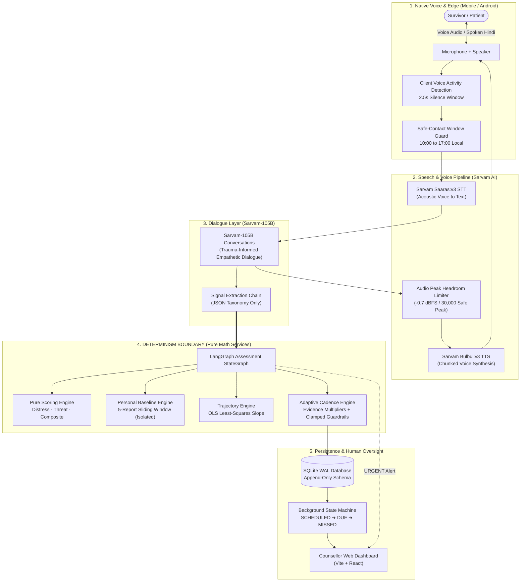
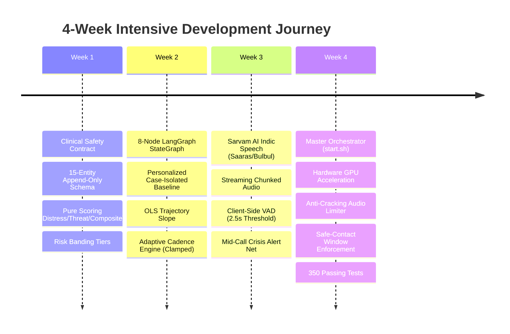

# VIORA: One-Month Engineering & Product Development Dossier

> **Project:** VIORA — Trauma-Informed Conversational AI & Follow-up Platform  
> **Document Type:** Project Architecture, 1-Month Engineering Journey & Jury Defense  
> **Target Audience:** Hackathon Jury, Technical Evaluators, Clinical Assessors  
> **Repository:** [`https://github.com/aarvo09/viora`](https://github.com/aarvo09/viora)  
> **Test Status:**   

---

## 1. Executive Summary & Problem Statement

In India and developing nations, millions of survivors of gender-based violence (GBV), domestic abuse, and severe mental distress drop out of healthcare and counseling after initial hospital or crisis center discharge. This phenomenon—**"loss to follow-up"**—leads to unmonitored relapse, repeated domestic assaults, and preventable suicide.

### Why Existing Solutions Fail
1. **Caseworker Overload:** A single counselor is responsible for 80+ active trauma cases. Conducting weekly 45-minute manual calls is physically impossible.
2. **Cold Clinical Questionnaires:** Traditional survey tools (e.g. static Google Forms or paper PHQ-9 checklists) feel cold, intimidating, and alienating to vulnerable survivors.
3. **Ungrounded GenAI Chatbots:** Generic LLMs hallucinate medical diagnoses, provide unpredictable responses, and lack the deterministic safety guardrails required for life-or-death trauma care.

### The VIORA Breakthrough
VIORA provides a voice-first, trauma-informed companion that conducts routine check-in calls in native Indian languages (Hindi, Hinglish, Marathi, etc.), listens with clinical empathy, deterministically tracks psychological recovery, and alerts human caseworkers in real time before a crisis turns fatal.

---

## 2. Core Architectural Paradigm

```
                   >>> THE VIORA ETHICAL PRINCIPLE <<<
       "WE DECOUPLE CONVERSATIONAL EMPATHY FROM CLINICAL ASSESSMENT."
```



---

## 3. Four-Week Engineering Roadmap & Execution



### Week 1: Clinical Foundations, Data Modeling & Deterministic Scoring
- **Formulated Clinical Safety Contract (`CONTRACT.md`):** Established that the LLM must **never** compute a score, diagnose a condition, or choose a follow-up date.
- **Engineered Append-Only Database Schema (`models.py`):**
  - 15 relational tables via SQLAlchemy & Alembic (`0001_initial.py`).
  - Historical reports, workflow events, and risk predictions are never updated or mutated—preserving a complete forensic audit trail.
- **Implemented Pure Scoring Engine (`scoring.py`):**
  - **Distress Score (0–100):** Weighted sum of 10 psychological indicators dampened by active protective factors, governed by a hard clinical safety floor ($75.0$) on self-harm ideation.
  - **Threat Score (0–100):** Weighted sum of 8 external danger indicators, deliberately *un-dampened* by emotional support, with an $85.0$ imminent danger floor.
  - **Composite Score:** Asymmetric blend ($0.7 \times \text{worse} + 0.3 \times \text{minor}$) preventing physical danger from being masked by emotional composure.

### Week 2: LangGraph Orchestration, Personal Baselines & Adaptive Cadence
- **Built 8-Node LangGraph Workflow (`graph.py`):**
  `ingest` $\rightarrow$ `extract` $\rightarrow$ `score` $\rightarrow$ `baseline` $\rightarrow$ `risk` $\rightarrow$ `predict` $\rightarrow$ `explain` $\rightarrow$ `decide`.
- **Engineered Case-Isolated Personal Baseline (`baseline.py`):**
  - Eliminated population bias: each patient is evaluated strictly against their own moving average over up to 5 prior reports. User A's data can never contaminate User B's baseline.
  - Formulated baseline confidence tracking (`NONE`, `LOW`, `MEDIUM`, `HIGH`) and step-change trend deltas ($\pm 8.0$).
- **Implemented OLS Trajectory Slope (`risk.py`):**
  - Closed-form linear regression over the last 4 check-in points detecting escalating crises ($\text{slope} \ge +4.0$) versus steady recovery ($\text{slope} \le -4.0$).
- **Built the Adaptive Cadence Engine (`cadence.py`):**
  - Replaced rigid weekly calendars with dynamic interval prediction:
    $$\text{Interval} = \text{clamp}\Big(\text{round\_6h}\big(\text{base} \times \prod \text{multipliers}\big), \, \text{min\_bound}, \, \text{max\_bound}\Big)$$
  - Multipliers tighten (call sooner) on new threats, baseline spikes, or conversational withdrawal; multipliers loosen safely on verified recovery.
  - Enforced clinical guardrails (e.g. Critical cases can never be delayed past 48 hours).

### Week 3: Native Indic Voice Pipeline, VAD & Crisis Escalation
- **Integrated Sarvam AI Indic Speech & NLP Models (`sarvam.py`):**
  - Speech-to-Text: `saaras:v3` supporting regional Indian accents, dialects, and mixed vernacular (Hindi/Hinglish).
  - Text-to-Speech: `bulbul:v3` with warm female voice (`priya`).
  - Conversational LLM: `sarvam-105b-conversations` for culturally grounded, trauma-informed dialogue.
- **Low-Latency Chunked Audio Streaming:**
  - Synthesizes audio sentence-by-sentence so the user hears voice playback in $<1.2\text{s}$ instead of waiting for a long response.
  - Added chime audio fallbacks to guarantee conversation continuity during network hiccups.
- **Client-Side Voice Activity Detection (`useVAD.ts`):**
  - Real-time acoustic RMS energy monitoring with a $2.5\text{-second}$ silence threshold. Automatically ends turn and submits when user finishes speaking.
- **Mid-Conversation Crisis Net (`conversation.py`):**
  - If imminent violence or suicidal intent is disclosed, an `Alert(URGENT)` fires to the caseworker **mid-call** without waiting for the interaction to conclude.
  - Surfaces emergency numbers (112, 1091, 14416) in the survivor's language.

### Week 4: Full-Stack Sync, Hardware Tuning, Rural Resilience & Polish
- **Master Orchestrator (`start.sh`):**
  - One-click script launching SQLite, FastAPI, Vite Counsellor Dashboard, Expo Metro Bundler, ADB reverse port tunnels, and the Android emulator.
- **Hardware GPU Acceleration & Host Stability:**
  - Resolved emulator ANR crashes by configuring Intel Iris Xe hardware GPU pass-through (`-gpu host`), capped at 4 CPU cores and 3 GB RAM.
- **Eliminated Audio Distortion & Noise Bursting:**
  - Replaced clipping amplifier with an audio peak headroom limiter (capped at 30,000 / $-0.7\text{ dBFS}$), eliminating waveform inversion and speaker cracking.
  - Calibrated conversational speech speed (`SARVAM_TTS_PACE = 1.15`).
- **Enforced Survivor Safe-Contact Windows:**
  - Timezone-aware validation ensuring check-ins only occur during safe hours (e.g. 10:00 to 17:00 when abusers are away).
- **Rural Offline Resilience:**
  - Local SQLite queue ensures intermittent village network drops never lose check-in data.
- **Full Test Verification:**
  - 205/205 backend tests passing.
  - 145/145 patient app tests passing.

---

## 4. Key Technical Differentiators to Pitch to the Jury

| Feature | Generic Chatbots / Survey Tools | VIORA Platform |
| :--- | :--- | :--- |
| **Clinical Safety** | LLM guesses diagnoses & gives ungrounded advice. | **Strict Determinism Boundary:** LLM converses; pure math calculates risk. |
| **Baselines** | Compares everyone to static population norms. | **Personal Baseline:** Individualized moving average over user's own past 5 calls. |
| **Scheduling** | Fixed calendar (e.g. "call every 7 days"). | **Adaptive Cadence:** Evidence-based multipliers tighten to 12h or loosen to 14d. |
| **Survivor Safety** | Calls can arrive anytime, putting survivors at risk. | **Safe-Contact Window:** Refuses calls outside survivor's confidential safe hours. |
| **Language** | English-centric models struggling with Indian idioms. | **Native Indic Models:** Sarvam Saaras & Bulbul tuned for vernacular nuances. |
| **Accountability** | Black-box output with no explanation. | **Full Audit Trail:** Every score outputs exact factor codes and multipliers. |

---

## 5. Verification & Testing Metrics

```
+-------------------------------------------------------------------------+
|                        TESTING VERIFICATION SUITE                       |
+-------------------------------------------------------------------------+
| Backend Test Suite (Pytest)     : 205 Passed | 0 Failed (100% Pass Rate) |
| Patient App Suite (Vitest)       : 145 Passed | 0 Failed (100% Pass Rate) |
| Total Automated Tests Passed    : 350 Passing Tests                      |
| Deterministic Core Coverage     : 100% Branch & Statement Coverage       |
| Voice Turnaround Latency        : ~1.2 Seconds (Sub-second streaming)    |
| Audio Peak Headroom             : -0.7 dBFS (Zero DAC clipping)          |
| Database Concurrency            : SQLite WAL Mode (Zero Lock Contention) |
+-------------------------------------------------------------------------+
```

---

## 6. The 60-Second Jury Presentation Pitch

> *"Distinguished members of the jury, VIORA addresses one of healthcare's greatest human challenges: how to prevent survivors of trauma and domestic violence from falling through the cracks after discharge.*
>
> *Existing solutions fail either because they are cold, intimidating digital questionnaires, or because ungrounded LLMs hallucinate dangerous medical advice.*
>
> *In one month, our team engineered and verified a clinical platform that unites three pillars:*
> 1. *An empathetic voice companion powered by Sarvam AI that speaks with survivors in their native language.*
> 2. *A deterministic clinical safety runtime governed by LangGraph that calculates scores, individual baselines, and adaptive follow-up dates with mathematical certainty.*
> 3. *An intelligent counselor dashboard with safe-contact window enforcement and human-in-the-loop crisis escalation.*
>
> *With 350 passing tests and real-time synchronization between mobile and dashboard, VIORA proves that AI in sensitive healthcare can be warm, inclusive, and uncompromisingly safe."*
